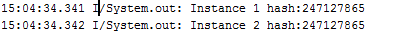

# Algorithm
## Leetcode 456. 132 Pattern
* difficulty: Medium
* description: Given a sequence of n integers a1, a2, ..., an, a 132 pattern is a subsequence ai, aj, ak such that i < j < k and ai < ak < aj. Design an algorithm that takes a list of n numbers as input and checks whether there is a 132 pattern in the list.

* analyse:因为平时用java比较多，所以还是想在刷题的时候练一练python。其实在做这道题的时候没有什么头绪，开始先暴力解了一遍，大概是n的三次方的复杂度,但是肯定是TLE了。然后想了下优化的解法，先考虑优化到n的平方的复杂度。考虑binary search的方法，由于132pattern和找峰值的题目很类似，但是由于其中这三个数字不是连续排位的，所以不能简单适用。
* solution

    1. Solution 1 O(n*n)

        这个解法就是从左向右遍历，找到向上的趋势；然后从此位置再向右找到向下的趋势；找到向下的趋势后再向右找到介于这个区间的点。每个趋势开始的地方其实就是一个极点。每次遍历就是找到从左向右的所有的极小值，找到每个极小值之后都会向右找到右边区间所有的极大值，从而找到是否存在132Pattern。
        代码如下：
        ```python
            def find132Pattern(self, nums):
                """
                :type nums: List[int]
                :rtype: bool
                """
                length = len(nums)
                if length <= 2 :
                    return False
                
                i = 0
                j = 0
                k = 0
                while i < length - 1 :
                    while i < length - 1 and nums[i] >= nums[i + 1] :
                        i += 1
                    j = i + 1
                    while j < length - 1 and nums[j] <= nums[j + 1] :
                        j += 1
                    k = j + 1
                    while k < length :
                        if nums[i] < nums[k] and nums[k] < nums[j]:
                            return True
                        k += 1
                    i = j + 1

                return False
        ```
    2. Solution2 n*n
        
        这个解法就是找到每个点左边的最小值，可以这样看：当左边区间取最小值时，最小值和当前点组成的最小值-最大值对可以获得132pattern的概率最大。
        ```python
            def find132PatternWithMin(self, nums):
                """
                :type nums: List[int]
                :rtype: bool
                """
                length = len(nums)
                if length <= 2 :
                    return False
                minium = sys.maxint
                
                for j in range(length):
                    minium = min(minium, nums[j])
                    if minium == nums[j]:
                        continue
                    for k in range(j + 1, 1, length - 1):
                        if nums[k] > minium and nums[k] < nums[j] :
                            return True
        
                return False
        ```
    
    3. Solution 3 O(n)

        这个解法是看了discuss里面的一个根据栈的解法来做的（https://discuss.leetcode.com/topic/67881/single-pass-c-o-n-space-and-time-solution-8-lines-with-detailed-explanation）
        也就是，从右向左遍历，s1是132中的1，即遍历对应的值，也就是要找s1右边是否存在32.初始化s3为比s1小的最大值，从右向左，如果stack空或者s1比当前栈顶值大，则出栈并更新s3直到栈顶比s1大。也就是栈内存的是按顺序的降序的数字，同时栈内存储的都是比s3大的数字，而且每次遍历都保证stack非空。因此由于栈内总比s3要大，所以只要找到比s3小的s1就可以了。
    
        ```python
            def find132pattern(self, nums):
                """
                :type nums: List[int]
                :rtype: bool
                """
                length = len(nums)
                if length <= 2:
                        return False
                stack = []
                s3 = -sys.maxsize
                for i in range(length - 1, -1, -1):
                    print(s3)
                    if nums[i] < s3 :
                        return True
                    else:
                        while len(stack) != 0 and nums[i] > stack[-1] :    
                            s3 = stack[-1]
                            stack.pop()

                    stack.append(nums[i])

                return False 
        ```

# Share
## [Do-it-yourself NLP for bot developers](https://medium.com/rasa-blog/do-it-yourself-nlp-for-bot-developers-2e2da2817f3d, "Medium link")

最近公司有需求要做基于客服对话数据的chatbot，要求满足能查询数据的需求。开始考虑基于rasa_nlu做对话系统，但是rasa的backend中spacy不支持中文模型，需要修改rasa源码和spacy源码；MITIE对机器性能要求过高，而且rasa官方也在考虑不再支持MITIE。查询资料时在medium上读到了这篇rasa作者写的对于chatbot开发者的指导，即为什么建议开发者建立自己的语言解析器而不是使用第三方API。

首先，要明白对一句话进行回复需要做什么工作。第一，明白这句话的意图-intent。第二，提取这句话里面你查询需要的信息。

文章列举了三个自己进行NLP的理由

* 如果你做的是基于商业场景下的chatbot，最好不要将用户传递的信息再传递给facebook或者microsoft
* http响应速度慢，而且你的程序也会被API的参数设计所限制；而使用组件库的话，可以根据自己的需求进行改造
* 可以根据已有数据和场景进行优化

文章接下来给出了基于词向量的简单实践，使用GLove做词嵌入,然后根据词向量做关键词匹配，选择相似度得分大于某个阈值的词语；然后做语义分类，将表达句子的词向量拼接起来,然后根据距离进行分类。之后介绍了使用库如何实践，比如spacy/MITIE。

# Tip
## Adding Zh Model to SpaCy
这里根据工作实践介绍下，如何向spacy中添加中文模型。

spacy提供了便捷的工具，可以将生成的语言模型打包成独立的package，之后可以利用pip安装。

### 为spacy添加中文分词器(基于哈工大ltp工具包)

在spacy中，每种语言都对应一个包。因此我们需要进入中文对应的目录，添加分词器的代码。

### 修改spacy源码
以ANACONDA_PATH表示Anaconda安装路径
```
ANACONDA_PATH/Lib/site-package/spacy/lang/zh
```

修改__init__.py如下：
```python
    # coding: utf8
from __future__ import unicode_literals
from ...language import Language
from ...tokens import Doc
from ...attrs import LANG
import os

class ChineseTokenizer(object):
    def __init__(self, cls, nlp=None):
        self.vocab = nlp.vocab if nlp is not None else cls.create_vocab(nlp)

    def __call__(self, text):
        try:
            from pyltp import Segmentor
        except ImportError:
            raise ImportError("The Chinese tokenizer requires the pyltp library: "
                              "https://github.com/HIT-SCIR/pyltp")
        LTP_DATA_DIR = 'D:/path/to/ltp_data' # 这里需要改成哈工大语言模型ltp对应的路径
        cws_model_path = os.path.join(LTP_DATA_DIR, 'cws.model')  # 分词模型路径，模型名称为`cws.model`
        segmentor = Segmentor()  # 初始化实例
        segmentor.load(cws_model_path)  # 加载模型
        words = segmentor.segment(text)  # 分词
        words = [x for x in words if x]
        return Doc(self.vocab, words=words, spaces=[False] * len(words))

    # add dummy methods for to_bytes, from_bytes, to_disk and from_disk to
    # allow serialization (see #1557)
    def to_bytes(self, **exclude):
        return b''

    def from_bytes(self, bytes_data, **exclude):
        return self

    def to_disk(self, path, **exclude):
        return None

    def from_disk(self, path, **exclude):
        return self

class ChineseDefaults(Language.Defaults):
    lex_attr_getters = dict(Language.Defaults.lex_attr_getters)
    lex_attr_getters[LANG] = lambda text: 'zh'

    @classmethod
    def create_tokenizer(cls, nlp=None):
        return ChineseTokenizer(cls, nlp)

class Chinese(Language):
    lang = 'zh'
    Defaults = ChineseDefaults

    def make_doc(self, text):
        return self.tokenizer(text)

__all__ = ['Chinese']
```

### 安装pyltp工具
```
pip install pyltp
```

### 下载pyltp分词模型
[下载地址](https://pan.baidu.com/share/link?shareid=1988562907&uk=2738088569#list/path=%2F)
解压后设置上面代码中LTP_DATA_DIR，指向解压出来的文件夹中的ltp_data目录

### 测试分词器
spacy采用pytest框架，所有的中文测试都在
```
ANACONDA_PATH/Lib/site-packages/spacy/tests/lang/zh
```

### 修改配置文件
```
spacy/tests/confests.py
```
* 添加中文代号’zh’
    ```
    _languages = ['bn', 'da', 'de', 'en', 'es', 'fi', 'fr', 'ga', 'he', 'hu', 'id', 'it', 'nb', 'nl', 'pl', 'pt', 'sv', 'xx', 'zh'] # zh需要自己添加
    ```
* 添加中文分词器
    ```
    @pytest.fixture
    def zh_tokenizer():
        return util.get_lang_class('zh').Defaults.create_tokenizer()
    ```

### 提供测试数据
spacy/tests/zh(如果没有，则创建)
*   添加__init__.py（空文件）
*   添加test_tokenizer.py如下
    ```
    # coding: utf8

    from __future__ import unicode_literals
    import pytest

    TOKENIZER_TESTS = [
            ("今天天气晴朗。", ['今天', '天气', '晴朗', '。']),
            ("我爱北京天安门。", ['我', '爱', '北京', '天安门', '。'])
    ]

    @pytest.mark.parametrize('text,expected_tokens', TOKENIZER_TESTS)
    def test_zh_tokenizer(zh_tokenizer, text, expected_tokens):
        tokens = [token.text for token in zh_tokenizer(text)]
        assert tokens == expected_tokens
    ```

### 运行测试
在spacy/tests/zh目录下，输入
```
py.test
```
pytest会自动运行test_tokenizer.py文件中的test_zh_tokenizer函数，并根据spacy/tests/confest.py中的fixture自动生成zh_tokenizer对象作为参数。

结果提示test pass即添加分词器成功。

### 生成spacy中文模型
spacy官方提供的英语模型包括分词器，词典，命名实体识别模型，句法依赖分析模型，词性标注模型。由于只是简单示例，我们将要生成的中文语言模型只包含分词器和词典。

* 为中文模型构建词典
    * 准备语料库
    
    sample_corpus.txt，内容如下
    ```
    你好  
    你好啊  
    你好吗  
    hello  
    hi  
    早上好  
    晚上好  
    嗨  
    是的  
    是  
    对的  
    确实  
    好  
    ok  
    好的  
    好的，谢谢你  
    对的  
    好滴  
    好啊  
    我想找地方吃饭  
    我想吃火锅啊  
    找个吃拉面的店  
    这附近哪里有吃麻辣烫的地方  
    附近有什么好吃的地方吗  
    肚子饿了，推荐一家吃饭的地儿呗  
    带老婆孩子去哪里吃饭比较好  
    想去一家有情调的餐厅  
    bye  
    再见  
    886  
    拜拜  
    下次见  
    感冒了怎么办  
    我便秘了，该吃什么药  
    我胃痛，该吃什么药？  
    一直打喷嚏怎么办  
    父母都有高血压，我会遗传吗  
    我生病了  
    头上烫烫的，感觉发烧了  
    头很疼该怎么办  
    减肥有什么好方法吗  
    怎样良好的生活习惯才能预防生病呢
    ```
    * 构建词典
    
    复制以下代码，命名为gen_sample_vocab.py

    ```python
    # coding: utf8

    from spacy.lang.zh import Chinese
    from spacy.vocab import Vocab
    from spacy.vectors import Vectors
    import stringstore_test as st
    import numpy as np

    # ---------- Global Para ----------

    # 创建语言类对象
    nlp = Chinese()

    #  构建分词器
    tokenizer = Chinese().Defaults.create_tokenizer(nlp)

    def gen_vocab(corpus_path):
        """构建示例vocab"""
        # ---------- StringStore ----------
        # 对样本语料切词，获取词列表
        word_set = set()
        with open(corpus_path) as file:
            for line in file.readlines():
                docs = tokenizer(line)
                words = [doc.text for doc in docs]
                word_set.update(words)
        word_list = [word for word in word_set]  # set => list
        
        # 利用词列表创建StringStore
        string_store = st.create_stringstore(word_list)

        # ---------- Vector ----------
        # 随机生成词向量，每个词用300维向量表示
        data = np.random.uniform(-1, 1, (len(word_list), 300))
        
        # vocab.vector.keys
        keys = word_list
        
        # 构建vectors
        vectors = Vectors(data=data, keys=keys)

        # ---------- Vocab ----------
        # 首先用StringStore创建词典，此时vocab.vectors无数据
        vocab = Vocab(strings=string_store)
        
        # 赋值vocab.vectors
        vocab.vectors = vectors
        return vocab
    ```

    * 利用以下代码创建中文模型，并输出到文件
    ```python
    # coding: utf8
    from spacy.language import Language
    import gen_sample_vocab as gv
    import os

    """
    尝试新建中文language model，并输出到文件，供rasa使用。参考：https://spacy.io/api/language#to_disk
    """

    # ------------------------ meta -------------------------------
    """语言模型配置字典"""
    meta = {
    "lang": "zh",
    "pipeline": [
    ],
    "name": "sample",
    "license": "CC BY-SA 3.0",
    "author": "Yongchen Hao",
    "url": "https://github.com/haoyongchen",
    "version": "0.0.0",
    "parent_package": "spacy",
    "vectors": {
        "keys": 90,
        "width": 300,
        "vectors": 300
    },
    "spacy_version": ">=2.0.0a18",
    "description": "Chinese sample model for spacy. Tokenizer and vocab only",
    "email": "haoycbupt@gmail.com"
    }
    # ------------------------ Vocab -----------------------------
    vocab = gv.gen_vocab('data/corpus/sample_corpus.txt')
    # ------------------------ Language -----------------------------
    """语言模型"""
    nlp = Language(vocab=vocab, meta=meta)
    # 输出语言模型
    nlp.to_disk(path='data/model/zh')
    ```

    运行上述代码之后，中文词典和分词器数据会保存在data/model/zh目录下
* 安装中文模型

    * 将包含语言模型的目录打包为可安装文件
    
    在data/model目录下
    ```
    python -m spacy package zh output
    ```
    该命令会在根据meta.json，在output目录下生成zh_sample-0.0.0。如果报错找不到output路径，则需要新建output文件夹。
    
    * 安装模型
    ```
    cd output/zh_sample-0.0.0
    python setup.py sdist
    pip install dist/zh_sample-0.0.0.tar.gz
    ```

# Review
## [如何构建完美的单例模式](https://medium.com/exploring-code/how-to-make-the-perfect-singleton-de6b951dfdb0)
第一次写ARTS，写对技术文章的分享和点评，开始没写之前是很想写的，但是有不知道怎么下笔。强行克服写完了对算法的总结和Tip，我发现写博客真的是能加深自己的理解，并且把对文章的理解重新梳理一遍。在找Review的素材时，看到这篇文章就非常想把它分享出来，想写点东西。

之前面试问过很多次设计模式，其中最主要的就是问单例模式。可能有的比较简单直接，让你写一个单例模式，要求比较高的就会让你看看是不是线程安全。其实单例模式背是好背的，但是背完了面试过去了，就又忘了。这个问题关键在于理解没理解，这篇文章非常有助于让人理解单例模式。

首先，我们应该了解单例模式是什么，以及我们为什么要使用单例模式，并且在什么场景下使用单例模式。

简而言之，单例模式就是只提供一个对象实例的设计模式，通过控制对象创建来限制实例数量为1。单例模式只允许一个入口来创建对象实例。单例模式经常出现在当开发人员想控制资源的场景，比如数据库连接或者socket连接。

虽然单例模式听上去很简单，但是当实现的时候有很多需要考虑的地方，而这些刚好可以帮助我们理解、完善单例模式。

接下来我们从简单的方法入手，逐渐完善单例模式。

单例模式最简单的实现方式就是使构造器private，由此可以得到两种单例模式，饿汉式（eager initialization）和懒汉式（lazy initialization）。

### 饿汉式
饿汉式将构造器设置为private，通过静态方法getInstance()创建和获取对象实例，因而在类加载时实例就被创建了。
```java
public class SingletonClass {

    private static volatile SingletonClass sSoleInstance = new SingletonClass();

    //private constructor.
    private SingletonClass(){}

    public static SingletonClass getInstance() {
        return sSoleInstance;
    }
}
```
饿汉式有一个问题，就是如果没有客户端使用这个对象实例的话，就可能造成内存泄漏。懒汉式可以解决这个问题。

### 懒汉式
和饿汉式不同，懒汉式选择在getInstance()方法里构造对象实例
```java
public class SingletonClass {

    private static SingletonClass sSoleInstance;

    private SingletonClass(){}  //private constructor.

    public static SingletonClass getInstance(){
        if (sSoleInstance == null){ //if there is no instance available... create new one
            sSoleInstance = new SingletonClass();
        }

        return sSoleInstance;
    }
}
```
我们知道，如果是同一个对象的话，那么其hashcode一定相等。可以通过hash的方法来检测是否获取到了同一个对象实例。
```java
public class SingletonTester {
   public static void main(String[] args) {
        //Instance 1
        SingletonClass instance1 = SingletonClass.getInstance();

        //Instance 2
        SingletonClass instance2 = SingletonClass.getInstance();

        //now lets check the hash key.
        System.out.println("Instance 1 hash:" + instance1.hashCode());
        System.out.println("Instance 2 hash:" + instance2.hashCode());  
   }
}
```
运行结果如下：


可以看到获取的是同一个实例

### 反射
反射是程序在运行时透过Reflection APIs取得并修改任何一个已知名称的class的内部信息的行为。假如我们通过反射将构造函数的标识符修改为public然后生成新的对象实例，再通过getInstance()获取的将会是不同的对象实例。
```java
public class SingletonTester {
   public static void main(String[] args) {
        //Create the 1st instance
        SingletonClass instance1 = SingletonClass.getInstance();
        
        //Create 2nd instance using Java Reflection API.
        SingletonClass instance2 = null;
        try {
            Class<SingletonClass> clazz = SingletonClass.class;
            Constructor<SingletonClass> cons = clazz.getDeclaredConstructor();
            cons.setAccessible(true);
            instance2 = cons.newInstance();
        } catch (NoSuchMethodException | InvocationTargetException | IllegalAccessException | InstantiationException e) {
            e.printStackTrace();
        }

        //now lets check the hash key.
        System.out.println("Instance 1 hash:" + instance1.hashCode());
        System.out.println("Instance 2 hash:" + instance2.hashCode());
   }
}
```
由于反射之后是根据构造函数直接创建的对象实例，所以我们可以选择从根本上杜绝这一行为，也就是在构造函数中抛出异常。
```java
public class SingletonClass {

    private static SingletonClass sSoleInstance;

    //private constructor.
    private SingletonClass(){
       
        //Prevent form the reflection api.
        if (sSoleInstance != null){
            throw new RuntimeException("Use getInstance() method to get the single instance of this class.");
        }
    } 

    public static SingletonClass getInstance(){
        if (sSoleInstance == null){ //if there is no instance available... create new one
            sSoleInstance = new SingletonClass();
        }

        return sSoleInstance;
    }
}
```
### 线程安全
假设单例对象实例还未被创建，当有两个线程同时调用getInstance()的时候会创建两个对象实例，因此是线程不安全的。

首先我们可以通过对getInstance()加synchronized关键字保证线程安全
```java
public class SingletonClass {

    private static SingletonClass sSoleInstance;

    //private constructor.
    private SingletonClass(){
       
        //Prevent form the reflection api.
        if (sSoleInstance != null){
            throw new RuntimeException("Use getInstance() method to get the single instance of this class.");
        }
    } 

    public synchronized static SingletonClass getInstance(){
        if (sSoleInstance == null){ //if there is no instance available... create new one
            sSoleInstance = new SingletonClass();
        }

        return sSoleInstance;
    }
}
```
但是对于getInstance()加synchronized关键字有两个缺点，第一就是上锁的开销比较大,第二就是锁的粒度过大。因此我们可以采用double-check的方式来解决粒度过大的问题，也就是当检查到null的时候再上锁，上锁之后为了检查是否和上锁之前状态一致，再检查是否是null。
```java
public class SingletonClass {

    private static SingletonClass sSoleInstance;

    //private constructor.
    private SingletonClass(){

        //Prevent form the reflection api.
        if (sSoleInstance != null){
            throw new RuntimeException("Use getInstance() method to get the single instance of this class.");
        }
    }

    public static SingletonClass getInstance() {
        //Double check locking pattern
        if (sSoleInstance == null) { //Check for the first time
          
            synchronized (SingletonClass.class) {   //Check for the second time.
              //if there is no instance available... create new one
              if (sSoleInstance == null) sSoleInstance = new SingletonClass();
            }
        }

        return sSoleInstance;
    }
}
```
之后我们可以使用volatile关键字，没有volatile，可能另外一个线程可以读取到单例的半初始化的状态。使用volatile可以添加内存屏障，阻止指令重排，并保证happens-before规则，所有对于对象实例的写都发生在读取之前。
```java
ublic class SingletonClass {

    private static volatile SingletonClass sSoleInstance;

    //private constructor.
    private SingletonClass(){

        //Prevent form the reflection api.
        if (sSoleInstance != null){
            throw new RuntimeException("Use getInstance() method to get the single instance of this class.");
        }
    }

    public static SingletonClass getInstance() {
        //Double check locking pattern
        if (sSoleInstance == null) { //Check for the first time
          
            synchronized (SingletonClass.class) {   //Check for the second time.
              //if there is no instance available... create new one
              if (sSoleInstance == null) sSoleInstance = new SingletonClass();
            }
        }

        return sSoleInstance;
    }
}
```

### 序列化和反序列化
将单例对象序列化并反序列化还原以后可以得到两个不同的对象,因此我们通过实现readResolve()方法来解决反序列化后的单例对象不一致问题。
```java

public class SingletonClass implements Serializable {

    private static volatile SingletonClass sSoleInstance;

    //private constructor.
    private SingletonClass(){

        //Prevent form the reflection api.
        if (sSoleInstance != null){
            throw new RuntimeException("Use getInstance() method to get the single instance of this class.");
        }
    }

    public static SingletonClass getInstance() {
        if (sSoleInstance == null) { //if there is no instance available... create new one
            synchronized (SingletonClass.class) {
                if (sSoleInstance == null) sSoleInstance = new SingletonClass();
            }
        }

        return sSoleInstance;
    }

    //Make singleton from serialize and deserialize operation.
    protected SingletonClass readResolve() {
        return getInstance();
    }
}
```
在解决了线程、反射和序列化带来的问题之后，这时的单例模式仍然不是完美的单例模式，对于不同的加载器下和clone也会是不安全的，但是这样的应用场景很少，我们基本上不再考虑了。


